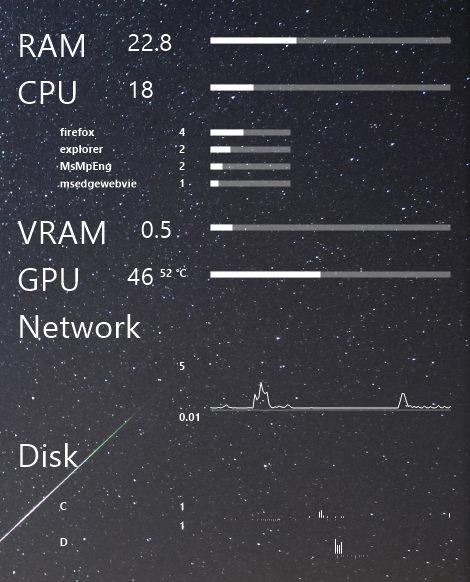

# One Gadget
One desktop gadget you will ever need. Optimized for your tastes.



[__Source code__](https://github.com/ahkscriptlerim/one-gadget/tree/main/Rust%20Workspace/?raw=true) and the [__standalone executable__](https://github.com/ahkscriptlerim/one-gadget/blob/main/Compiled%20Standalone/One%20Gadget.exe?raw=true) rest in their directories, available for __download__.


## 🚀 Run
When run, it __automatically__:

- Detects __monitors__ and __DPI__ then places itself.

- Loads __configuration__ from its `.ini`. Creates one with defaults when no `.ini` exists.

- Checks for `.ini` __file modifications__. When the user makes changes, at the next check (`10 sec` default), updates the program while running.

__Tray icon__ can be __double clicked__ to close the program or __right clicked__ to directly open or load the `.ini`.

Showing __temperatures__ need `admin` rights when opening the `.exe`.


## ✨ About the Program
__Rust__ is a language that looks like a computer language. __Rust__ is cool.

Executable is __standalone__.

Program is strictly __optimized__.

Recommended for __all__.


## 📦 About Compilation
Compiled on (and built for) __Win10 x64__.

Could be modified for other systems such as __Linux__ where getting hardware info is easier, more significantly more natural, without the need of a certified driver.


## 🛠️ INI Configuration
Defaults are for __general users__. For __power users__ my setup is:

```ini
; One Gadget Configuration
; Visual clutter
GPU_HIDE_WHEN_IDLE=1
DISK_HIDE_WHEN_IDLE=1
PROCESS_HIDE_WHEN_IDLE=1
PROCESS_HIDE_BARS_WHEN_IDLE=1
SHOW_TEMPERATURES=1
HIDE_ZEROS=1
; Different functionality
CPU_TASKMGR_PERCENTAGE_LOGIC=0
GPU_ALWAYS_VISIBLE=0
NET_SHOW_CURRENT_MB=0
SHOW_CPU_TEMP=0
SHOW_GPU_TEMP=1
TEMP_SUFFIX=" °C"
; Core features
RENDER_INTERVAL_SECS=2
INI_CHECK_INTERVAL_SECS=10000
; Program features
TARGET_MONITOR_INDEX=0
ENABLE_TRAY=1
RUN_ON_STARTUP=1
; Style decisions
; ...
; More in Rust source code: main.rs
```

__Hiding__ titles may cause unwanted __flicker__ depending on the usage so it is totally up to the user. For example new `GPU`'s disable themselves so load stays at `0%` for a long time. For some `drives`, maybe longer time. `Process` bar show / hide cycles are more frequent and may disturb some eyes. So, all have their respective `.ini` variables.

`CPU_TEMPERATURE` may or may not be catched since we follow neither installation of mock driver nor trying to get certification for our mock driver path.

`NET_SHOW_CURRENT_MB` can be toggled to show current value instead of graph scale.

`RENDER_INTERVAL_SECS` can well be adjusted as `1 sec`.

`INI_CHECK_INTERVAL_SECS` uses cache by definition so has very little impact for using smallest file. Since a second is an eternity, user experience matters while selecting such a value. When working on file, could well be set to `1 sec`. Still, through users which won't ever use this can set this to a __high value__ like me. But remember to set to a high value as your last modification for `.ini` values wont be fetched for a long time afterwards 😁 Program restart or tray menu reload config would still work solid.

`RUN_ON_STARTUP` enabling by setting to `1` is strongly recommended. Startup injection needs user consent, naturally.

Still, font, font sizes, background color `COLOR_TRANSPARENT`, even layout can be modified from within the source code. There are many `global variables`. Functionalities are also direct. For example `.ini` can be opened with another program instead of __Notepad__ or more decimal digits can be displayed. Features are supported with comments, must be relatively easy to find.


## 🛡️ Architecture
Fusing the raw power of __Rust__ with __precomputation__, the architecture reaches new heights:

|  |  |
| :--- | :--- |
| __Architectural Strengths__ | |
| __Display & Multi-Monitor__ | Pixel-Perfect High-DPI |
| __Windows Desktop Attachment__ | Robust Shell Integration |
| __Lazy Initialization__ | Zero Overhead |
| __Runtime Operation__ | Zero Redundant Computation |
| __Hot-Path Efficiency__ | Zero Hot-Path Allocations |
| __Memory Safety & Aging__ | Immune to Leak / Aging |
| __Garbage Collection__ | No GC Required |
| __Thread Safety & Locks__ | Deadlock-Free |
| __Self-Contained Deployment__ | Zero External Dependencies |
|  |  |


## ⚡ Runtime Stats

|  |  |
| :--- | :--- |
| __RAM__ | __~19.1 MB__ (Solid, stable). |
| __CPU__ | __~0.05%__ (Sometimes practically invisible to the OS scheduler). |
|  |  |


